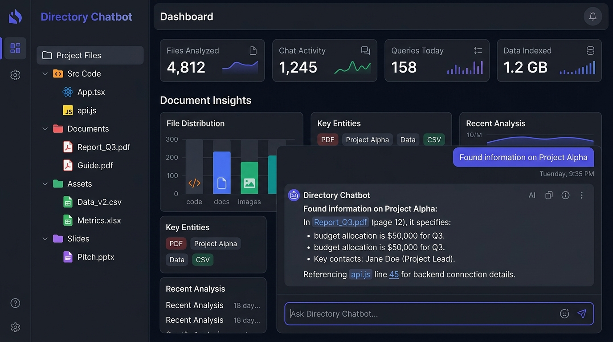

# 📁 Directory Chatbot / Parser

[](https://opensource.org/licenses/MIT)
[](https://www.typescriptlang.org/)
[](https://react.dev/)
[](https://expressjs.com/)
[](https://vite.dev/)
[](https://tailwindcss.com/)
[](https://github.com/google/generative-ai-js)

<p align="center">
  
</p>

An elegant, fully-featured **full-stack chatbot, workspace explorer, and multi-document parser**. It allows you to select, read, index, and analyze files in any directory on your computer or cloud workspace. Powered by highly optimized, lay-flat parsers and a rich UI interface, it provides deep workspace-level question answering, real-time code editing, search-and-replace, and full file-system context indexing.

---

## 🚀 Key Features

### 📄 1. Advanced Multi-Document Encoding (Binary & Office Formats)
Unlike standard chatbots that only parse plaintext, this workspace engine has dedicated server-side extraction logic for complex documents:
* **PDFs (`.pdf`)**: Direct binary extraction of streams utilizing layout preservation rules.
* **Word Documents (`.docx`)**: Micro-parsed typography structures leveraging Mammoth parser logic.
* **Excel Tab Spreadsheet Panels (`.xlsx`)**: Renders full grid systems in a beautiful web spreadsheet panel with selectable worksheets/tabs in the browser.
* **PowerPoint Slides (`.pptx`)**: Custom slide-by-slide XML component extraction.
* **Multimodal Image Previews (`.png`, `.jpg`, `.jpeg`, `.webp`, `.gif`)**: Renders a rich image-viewer stage with automatic high-resolution native image passing (using base64 data parts) directly to Gemini for visual UI audits and mockup analysis.

### 🧠 2. Adaptive RAGLite (Retrieval-Augmented Generation) Engine
Struggling with token overhead on massive projects? The engine features smart, configurable indexing:
* Highly responsive chunking algorithms (with overlapping boundaries) targeting document nodes.
* Query term relative keyword-match scoring for targeted context construction.
* Redundancy and white-space code compressors built to squeeze license files and empty lines before context injection.
* Automatic, intelligent fallback options if no keyword matches are identified.

### 🛠️ 3. Full-Fidelity Interactive Code Inspector
* **File Tree Navigation**: Fully customizable explorer identifying file sizes, extensions, and attachment status.
* **Aesthetic Editor**: Integrated live editing panel with line numbers and manual save capabilities (with `Ctrl+S`).
* **Find & Replace Engine**: Built-in utility directly over the text editor for rapid workspace modifications.
* **Markdown Renderer**: Full Markdown-rendering support (`react-markdown`) for clear code blocks and explanations.

---

## 🏗️ Architecture Stack

The system is constructed with a modern, high-performance decoupled structure:

```
[🖥️ Client-Side Web App] (React 19 + Vite 6 + Tailwind CSS v4)
       │
       │  (JSON / Multi-part Payload API)
       ▼
[⚙️ Server-Side System] (Express 4 API + esbuild Asset Bundling)
       │
       ├─► [Document Extraction Engines] ──────► [pdf-parse, mammoth, xlsx, adm-zip]
       ├─► [RAGLite Token Chunkers]
       │
       ▼
[🤖 Inference Layer] (Official @google/genai Native SDK + Gemini Models)
```

---

## ⏱️ Local Setup & Quickstart

Follow these steps to spin up the application on your local machine:

### 📋 Prerequisites
* **Node.js**: v18.0.0 or higher
* **npm**: v9.0.0 or higher

### ⚙️ Installation
1. Clone the repository to your machine:
   ```bash
   git clone https://github.com/moroshani/directory-parser.git
   cd directory-parser
   ```

2. Install all development and core dependencies:
   ```bash
   npm install
   ```

3. Configure your Environment Variables. Create a `.env` file in the root of your project:
   ```env
   # .env
   GEMINI_API_KEY=your_gemini_api_key_here
   ```
   *(You can obtain an API key from Google AI Studio. Note that this key remains strictly server-side and is never exposed to the client browser.)*

### 🚀 Running the App
* **Start Development Mode**: Runs the dev server with Hot Reloading active on `http://localhost:3000`:
  ```bash
  npm run dev
  ```

* **Compile for Production**: Sets up a bundled, optimized build folder for distribution:
  ```bash
  npm run build
  ```

* **Start Production Artifacts**: Instantiates the production server directly:
  ```bash
  npm run start
  ```

---

## 🧩 Running with Local AI Integrations (Ollama, Codex, VS Code Plugins)

Because the project is structured to read files and provide a clean, serialized representation of any folder, you can easily adapt this codebase to run **entirely isolated from the internet** (local-first):

1. **Local LLM Backend**: Swap the `@google/genai` call in `server.ts` with local inference endpoints like **Ollama** (e.g., `http://localhost:11434/v1/chat/completions`) or **Llama.cpp**.
2. **VS Code & Cursor Plugins**: By passing the parsed workspace index or file chunks locally, you can use standard IDE plugins to interact with the directory structure without sending documents to third-party servers.

---

## 📂 Project Structure

```
├── .env.example            # Sample configuration file
├── .gitignore              # Files to ignore (node_modules, dist, builds)
├── LICENSE                 # Open-Source MIT License
├── README.md               # Visual project documentation
├── server.ts               # Production-grade Express API server & parser layer
├── package.json            # Node scripts & dependencies
├── tsconfig.json           # Type configurations
├─- vite.config.ts          # Bundling settings
├── metadata.json           # Application descriptor
├── assets/                 # Brand layouts & visuals
└── src/                    # App UI Codebase
    ├── main.tsx            # React framework entry point
    ├── App.tsx             # Root template & core visual layout
    ├── index.css           # Global custom classes & Tailwind setup
    └── components/         # Interactive UI components
        ├── FileTree.tsx    # File Hierarchy visualizer
        ├── FileInspector.tsx # Code Highlight & binary table displays
        └── ...
```

---

## 🤝 Contribution Guidelines

Contributions are incredibly welcome! If you want to expand support for other binary formats (such as `.epub` or database models), please follow these steps:
1. Fork the Project.
2. Create your Feature Branch (`git checkout -b feature/CoolFeature`).
3. Commit your Changes (`git commit -m 'Add support for Epic Extension'`).
4. Push to the Branch (`git push origin feature/CoolFeature`).
5. Open a Pull Request.

---

## 📜 License

Distributed under the **MIT License**. See `LICENSE` for more detailed licensing information.
